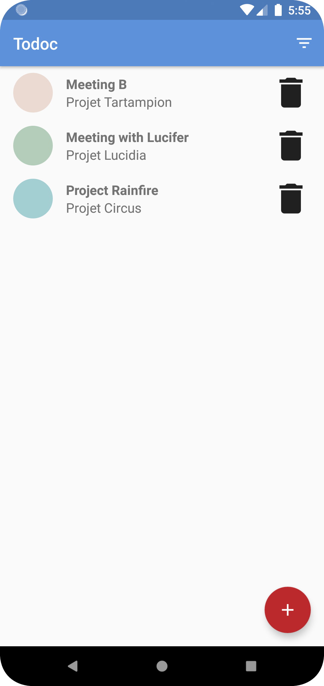
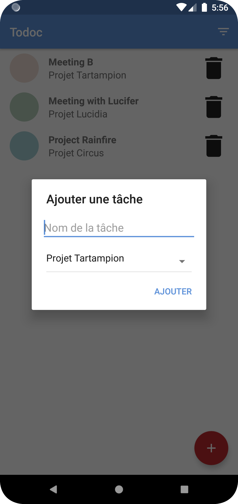
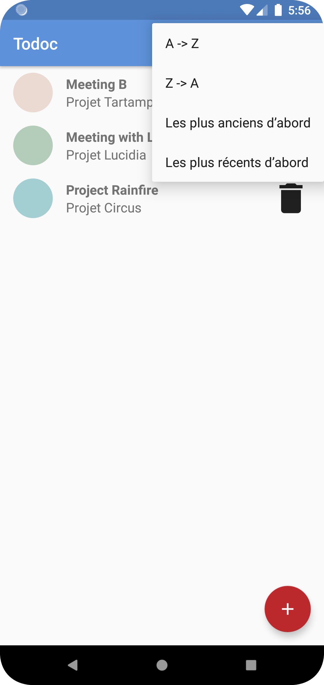

# ToDoc

## About
This is my fifth project for Openclassrooms' **Android App Development program**.
This **Native Android App "ToDoc"** is a basic and fluid task management app for better productivity and workflow.
The source code package features also a folder "/Diagrams" containing a  **Class_Diagram**, a  **Physical_Data_Model** and a  **Use_Case_Diagram**.

## Testing
This source code package incorporates **unit tests** and **instrumentation tests** as well as **HTML results** of these tests.

## Installation
Clone/Download this repository and open it with **Android Studio**
```bash
git clone https://github.com/SimoJOUDAR/P5_Todoc.git
```

## Run the App
Once the project opened, you can run the App using Android studio's AVD to execute it.

## Obfuscation
The source code has obfuscation and shrinkResources enabled. It uses an external obfuscation dictionary available at https://bit.ly/3uGrnSu

## Generating signed APK
From Android Studio:
1. Go to ***Build*** menu
2. Go to ***Build Bundle(s) / APK(s)***
3. Click on ***Build APK(s)***
   The APK generated can be loaded and run on any Android phone.

## Preview
  

https://user-images.githubusercontent.com/80898080/185967736-dfe2ce0d-2421-48c3-818c-0eec6258b5e4.mp4